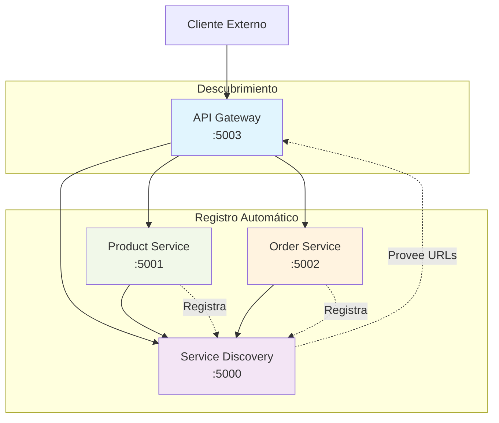

# 🚀 Aplicación de Microservicios con Patrones en .NET 8

### 📋 Descripción
Una aplicación demostrativa que implementa una arquitectura de microservicios con patrones comunes como Service Discovery, API Gateway, y principios SOLID.

### 🏗️ Estructura de la Solución
```
MicroservicesDemo/
├── ApiGateway/                 # API Gateway (YARP Reverse Proxy)
├── ServiceDiscovery/           # Servicio de descubrimiento (Registry)
├── ProductService/             # Microservicio de productos
├── OrderService/               # Microservicio de órdenes
├── SharedModels/               # Modelos de datos compartidos
└── SharedKernel/               # Servicios y lógica compartida
```

## 🔗 Dependencias entre Proyectos

| Proyecto          | Tipo                       | Dependencias                                                                 |
|-------------------|----------------------------|-------------------------------------------------------------------------------|
| **SharedModels**  | Class Library              | —                                                                             |
| **SharedKernel**  | Class Library              | Microsoft.Extensions.Hosting.Abstractions<br>Microsoft.Extensions.Http<br>Microsoft.Extensions.Logging.Abstractions |
| **ServiceDiscovery** | ASP.NET Core Web API     | Microsoft.AspNetCore.OpenApi<br>SharedKernel                                  |
| **ProductService**   | ASP.NET Core Web API     | Microsoft.AspNetCore.OpenApi<br>SharedModels<br>SharedKernel                  |
| **OrderService**     | ASP.NET Core Web API     | Microsoft.AspNetCore.OpenApi<br>SharedModels<br>SharedKernel                  |
| **API Gateway**      | ASP.NET Core Web API     | Yarp.ReverseProxy<br>Microsoft.Extensions.Http                                |


## 🎯 Patrones Implementados
1. Service Discovery Pattern ✅
```csharp
// Registro automático de servicios
services.AddHostedService<ServiceRegistrationBackgroundService>();
```

2. API Gateway Pattern ✅
```csharp
// Punto de entrada único para todos los microservicios
app.MapReverseProxy();
```

3. Client-Side Discovery ✅
```csharp
// Los servicios se registran automáticamente al iniciar
_serviceRegistry.RegisterService(serviceName, serviceUrl);
```

4. Open/Closed Principle ✅
```csharp
// Servicios extensibles mediante interfaces
public interface IProductService
public class InMemoryProductService : IProductService
```

5. Single Responsibility Principle ✅
```csharp
// Cada microservicio tiene una responsabilidad única
- ProductService: Gestión de productos
- OrderService: Gestión de órdenes
- ServiceDiscovery: Registro de servicios
```

## 🌐 Diagrama de Arquitectura


## 🚀 Cómo Ejecutar
1. Ejecución Manual (Recomendado para desarrollo)
```sh
cd AWS_Microservices_Demo_.NET8

dotnet run --project ServiceDiscovery\ServiceDiscovery.csproj
dotnet run --project ProductService\ProductService.csproj
dotnet run --project OrderService\OrderService.csproj
dotnet run --project ApiGateway\ApiGateway.csproj

dotnet run --project ServiceDiscovery\ServiceDiscovery.csproj --urls http://localhost:5000
dotnet run --project ProductService\ProductService.csproj --urls http://localhost:5001
dotnet run --project OrderService\OrderService.csproj --urls http://localhost:5002
dotnet run --project ApiGateway\ApiGateway.csproj --urls http://localhost:5003
```

2. Script de Inicio Automático
```sh
# Ejecutar el script start-all.bat
.\start-all.bat
```
```bat
@echo off
echo Starting Microservices...

echo Starting Service Discovery on port 5000...
start "ServiceDiscovery" dotnet run --project ServiceDiscovery\ServiceDiscovery.csproj --urls http://localhost:5000
timeout /t 2 /nobreak >nul

echo Starting Product Service on port 5001...
start "ProductService" dotnet run --project ProductService\ProductService.csproj --urls http://localhost:5001
timeout /t 2 /nobreak >nul

echo Starting Order Service on port 5002...
start "OrderService" dotnet run --project OrderService\OrderService.csproj --urls http://localhost:5002
timeout /t 2 /nobreak >nul

echo Waiting for services to start...
timeout /t 5 /nobreak >nul

echo Starting API Gateway on port 5003...
start "ApiGateway" dotnet run --project ApiGateway\ApiGateway.csproj --urls http://localhost:5003

echo All services are starting...
echo Service Discovery: http://localhost:5000
echo Product Service: http://localhost:5001
echo Order Service: http://localhost:5002
echo API Gateway: http://localhost:5003
echo.
echo Press any key to stop all services...
pause >nul

echo Stopping all services...
taskkill /f /im dotnet.exe >nul 2>&1
echo All services stopped.
```

3. Docker Compose
- Construir y ejecutar todos los servicios
```sh
# Limpiar todo
docker-compose down -v
docker system prune -f

# Reconstruir y levantar
docker-compose up --build

# Verificar que todo esté funcionando
curl http://localhost:5000/health    # ServiceDiscovery
curl http://localhost:5001/health    # ProductService  
curl http://localhost:5002/health    # OrderService
curl http://localhost:5003/health    # ApiGateway

# Probar a través del gateway
curl http://localhost:5003/api/products
curl http://localhost:5003/api/orders
```
- logs
```sh
docker-compose logs -f
docker-compose logs -f api-gateway
```
- Detener servicios
```sh
docker-compose down
```
- Detener servicios
```sh
docker-compose up -d --build product-service
```

3. Docker independenciete por servicio
- Service Discovery
```sh
docker build -f ServiceDiscovery/Dockerfile -t service-discovery:1.0 .
```
```sh
docker run -d -p 5000:5000 --name service-discovery-container service-discovery:1.0
```
- Product Service
```sh
docker build -f ProductService/Dockerfile -t product-service:1.0 .
```
```sh
docker run -d -p 5001:5001 --name product-service-container -e ServiceDiscoveryUrl=http://host.docker.internal:5000 product-service:1.0
```
- Order Service
```sh
docker build -f OrderService/Dockerfile -t order-service:1.0 .
```
```sh
docker run -d -p 5002:5002 --name order-service-container -e ServiceDiscoveryUrl=http://host.docker.internal:5000 order-service:1.0
```
- API Gateway
```sh
docker build -f ApiGateway/Dockerfile -t api-gateway:1.0 .
```
```sh
docker run -d -p 5003:5003 --name api-gateway-container -e ServiceDiscoveryUrl=http://host.docker.internal:5000 api-gateway:1.0
```

## 🔍 Endpoints Disponibles

### 🛰 Service Discovery (:5000)

| Método | Endpoint | Descripción |
|--------|----------|-------------|
| GET    | `/api/registry/discover?serviceName={name}` | Descubrir servicios |
| POST   | `/api/registry/register?serviceName={name}&serviceUrl={url}` | Registrar servicio |
| POST   | `/api/registry/unregister?serviceName={name}&serviceUrl={url}` | Desregistrar servicio |
| GET    | `/health` | Health check |

---

### 📦 Product Service (:5001)

| Método | Endpoint | Descripción |
|--------|----------|-------------|
| GET    | `/api/products` | Obtener todos los productos |
| GET    | `/api/products/{id}` | Obtener producto por ID |
| POST   | `/api/products` | Crear nuevo producto |
| GET    | `/health` | Health check |

---

### 📝 Order Service (:5002)

| Método | Endpoint | Descripción |
|--------|----------|-------------|
| GET    | `/api/orders` | Obtener todas las órdenes |
| GET    | `/api/orders/{id}` | Obtener orden por ID |
| POST   | `/api/orders` | Crear nueva orden |
| GET    | `/health` | Health check |

---

### 🌐 API Gateway (:5003)

| Método | Endpoint | Descripción |
|--------|----------|-------------|
| GET    | `/api/products` | → Redirige a Product Service |
| GET    | `/api/orders` | → Redirige a Order Service |
| GET    | `/health` | Health check del gateway |


## 🧪 Pruebas y Verificación

- Verificación Manual
```sh
# Verificar servicios registrados
curl http://localhost:5000/api/registry/discover?serviceName=ProductService
curl http://localhost:5000/api/registry/discover?serviceName=OrderService

# Verificar health checks
curl http://localhost:5001/health
curl http://localhost:5002/health
curl http://localhost:5003/health

# Probar through API Gateway
curl http://localhost:5003/api/products
curl http://localhost:5003/api/orders
```

## 🚀 Despliegue en AWS y Funcionamiento del API Gateway

1. ✅ El cliente hace request al Gateway: GET /api/products
2. ✅ Gateway redirige al servicio correcto: → http://product-service:5001/api/products
3. ✅ El servicio procesa y responde: 200 OK con datos JSON
4. ✅ Gateway devuelve la respuesta al cliente

- El Gateway NO necesita saber los endpoints específicos - solo necesita saber a qué servicio rediririgir cada patrón de ruta.

## 🛣️ Cómo funciona el routing con YARP:
- Configuración actual:
```csharp
// Redirige TODO /api/products/** → ProductService
Path = "/api/products/{**catch-all}"

// Redirige TODO /api/orders/** → OrderService  
Path = "/api/apis/{**catch-all}"
```

## 🌐 API Gateway → Product Service

| Request al Gateway        | Redirige a                                  | Resultado |
|----------------------------|---------------------------------------------|-----------|
| GET `/api/products`        | http://localhost:5001/api/products          | ✅ Funciona |
| GET `/api/products/1`      | http://localhost:5001/api/products/1        | ✅ Funciona |
| POST `/api/products`       | http://localhost:5001/api/products          | ✅ Funciona |
| PUT `/api/products/1`      | http://localhost:5001/api/products/1        | ✅ Funciona |
| DELETE `/api/products/1`   | http://localhost:5001/api/products/1        | ✅ Funciona |


## 🚀 Despliegue en AWS - 4 Máquinas EC2
### 📦 Estructura recomendada:
```text
4 Instancias EC2:
- ec2-service-discovery (Service Discovery)
- ec2-product-service (Product Service) 
- ec2-order-service (Order Service)
- ec2-api-gateway (API Gateway)
```

### ⚙️ Configuración con Variables de Entorno:
- Service Discovery (ec2-service-discovery):
```sh
# User data al crear la EC2
#!/bin/bash
export ASPNETCORE_URLS="http://*:5000"
export ServiceDiscoveryUrl="http://ec2-service-discovery:5000"
cd /app
dotnet ServiceDiscovery.dll
```
- Product Service (ec2-product-service):
```sh
#!/bin/bash  
export ASPNETCORE_URLS="http://*:5001"
export ServiceDiscoveryUrl="http://ec2-service-discovery:5000"
cd /app
dotnet ProductService.dll
```
- Order Service (ec2-order-service):
```sh
#!/bin/bash
export ASPNETCORE_URLS="http://*:5002" 
export ServiceDiscoveryUrl="http://ec2-service-discovery:5000"
cd /app
dotnet OrderService.dll
```
- API Gateway (ec2-api-gateway):
```sh
#!/bin/bash
export ASPNETCORE_URLS="http://*:5003"
export ServiceDiscoveryUrl="http://ec2-service-discovery:5000"
cd /app
dotnet ApiGateway.dll
```
- 🔧 Configuración dinámica en appsettings.json:
```json
// En todos los servicios, reemplaza localhost con variables:
{
  "Urls": "http://*:5000",
  "ServiceDiscoveryUrl": "http://${SERVICE_DISCOVERY_HOST:-localhost}:5000"
}
```

## 📋 Orden CRÍTICO de ejecución:
1. 📍 Service Discovery - Primero siempre
2. 📦 Product Service - Segundo
3. 📦 Order Service - Tercero
4. 🚪 API Gateway - Último (después de 30-60 segundos)

---
