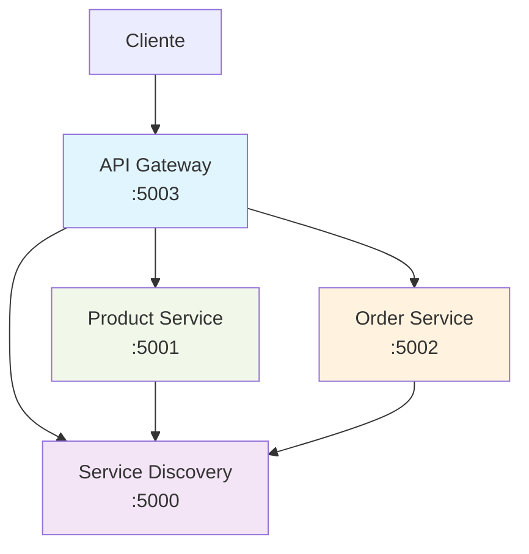

# Aplicación de Microservicios con .NET 8

Demostración de arquitectura de microservicios implementando patrones Service Discovery, API Gateway y principios SOLID.

## Estructura del Proyecto

```
MicroservicesDemo/
├── ApiGateway/                 # API Gateway (YARP Reverse Proxy)
├── ServiceDiscovery/           # Servicio de descubrimiento (Registry)
├── ProductService/             # Microservicio de productos
├── OrderService/               # Microservicio de órdenes
├── SharedModels/               # Modelos de datos compartidos
└── SharedKernel/               # Servicios compartidos
```

## Patrones Implementados

- **Service Discovery Pattern**: Registro automático y descubrimiento de servicios
- **API Gateway Pattern**: Punto de entrada único para todos los microservicios
- **Client-Side Discovery**: Los servicios se registran automáticamente al iniciar
- **SOLID Principles**: Interfaces bien definidas y responsabilidades únicas

## Arquitectura



## Ejecución Local

### 1. Script Automático (Recomendado)
```bash
.\start-all.bat
```

### 2. Manual
```bash
dotnet run --project ServiceDiscovery\ServiceDiscovery.csproj --urls http://localhost:5000
dotnet run --project ProductService\ProductService.csproj --urls http://localhost:5001
dotnet run --project OrderService\OrderService.csproj --urls http://localhost:5002
dotnet run --project ApiGateway\ApiGateway.csproj --urls http://localhost:5003
```

## Docker

### Docker Compose (Recomendado)
```bash
# Limpiar contenedores y volúmenes existentes
docker-compose down --volumes --remove-orphans
docker system prune -f

# Construcción y ejecución
docker-compose up --build

# Ejecutar en background
docker-compose up -d --build

# Actualizar servicio específico
docker-compose up -d --build product-service

# Ver logs
docker-compose logs -f
docker-compose logs -f api-gateway

# Verificar servicios
curl http://localhost:5000/health    # ServiceDiscovery
curl http://localhost:5001/health    # ProductService  
curl http://localhost:5002/health    # OrderService
curl http://localhost:5003/health    # ApiGateway

# Probar API Gateway
curl http://localhost:5003/api/products
curl http://localhost:5003/api/orders

# Detener servicios
docker-compose down
```

### Contenedores Individuales con Red
```bash
# Crear red
docker network create microservices-network

# Construir imágenes
docker build -f ServiceDiscovery/Dockerfile -t service-discovery:latest .
docker build -f ProductService/Dockerfile -t product-service:latest .
docker build -f OrderService/Dockerfile -t order-service:latest .
docker build -f ApiGateway/Dockerfile -t api-gateway:latest .

# Ejecutar servicios en orden
docker run -d --name service-discovery \
  --network microservices-network \
  -p 5000:8080 \
  service-discovery:latest

docker run -d --name product-service \
  --network microservices-network \
  -p 5001:8080 \
  -e ServiceDiscoveryUrl=http://service-discovery:8080 \
  product-service:latest

docker run -d --name order-service \
  --network microservices-network \
  -p 5002:8080 \
  -e ServiceDiscoveryUrl=http://service-discovery:8080 \
  order-service:latest

docker run -d --name api-gateway \
  --network microservices-network \
  -p 5003:8080 \
  -e Services__ProductService__Url=http://product-service:8080 \
  -e Services__OrderService__Url=http://order-service:8080 \
  api-gateway:latest

# Verificar contenedores
docker ps

# Limpiar todo
docker stop $(docker ps -aq)
docker rm $(docker ps -aq)
docker network rm microservices-network
```

## Endpoints

### Service Discovery (:5000)
| Método | Endpoint | Descripción |
|--------|----------|-------------|
| GET    | `/api/registry/discover?serviceName={name}` | Descubrir servicios |
| POST   | `/api/registry/register?serviceName={name}&serviceUrl={url}` | Registrar servicio |
| GET    | `/health` | Health check |

### Product Service (:5001)
| Método | Endpoint | Descripción |
|--------|----------|-------------|
| GET    | `/api/products` | Obtener productos |
| GET    | `/api/products/{id}` | Obtener producto por ID |
| POST   | `/api/products` | Crear producto |

### Order Service (:5002)
| Método | Endpoint | Descripción |
|--------|----------|-------------|
| GET    | `/api/orders` | Obtener órdenes |
| GET    | `/api/orders/{id}` | Obtener orden por ID |
| POST   | `/api/orders` | Crear orden |

### API Gateway (:5003)
| Método | Endpoint | Descripción |
|--------|----------|-------------|
| GET    | `/api/products` | → Redirige a Product Service |
| GET    | `/api/orders` | → Redirige a Order Service |

## Agregar Nuevo Servicio

1. Crear proyecto del servicio
2. Crear `Dockerfile`
3. Actualizar `docker-compose.yml`:
```yaml
notification-service:
  build:
    context: .
    dockerfile: NotificationService/Dockerfile
  ports:
    - "5004:8080"
  environment:
    - ServiceDiscoveryUrl=http://service-discovery:8080
  depends_on:
    service-discovery:
      condition: service_healthy
  networks:
    - microservices-network
```
4. Agregar ruta en API Gateway

## Despliegue en AWS

### ECS con Docker Compose
```bash
# Crear contexto ECS
docker context create ecs mycontext --from-env
docker context use mycontext
docker compose up
```

### ECS Tradicional
1. Crear repositorios ECR
2. Construir y subir imágenes
3. Crear Task Definition
4. Crear ECS Service

### EC2 (4 Instancias)
- **ec2-service-discovery**: Service Discovery
- **ec2-product-service**: Product Service  
- **ec2-order-service**: Order Service
- **ec2-api-gateway**: API Gateway

## Troubleshooting

### Docker Compose vs Contenedores Individuales
- **Compose**: Crea red automáticamente, permite comunicación por nombre
- **Individual**: Requiere crear red manualmente con `docker network create`

### Orden de Inicio
1. Service Discovery (primero)
2. Product Service
3. Order Service  
4. API Gateway (último)

### Variables de Entorno
```bash
# Docker
ServiceDiscoveryUrl=http://service-discovery:8080

# Local
ServiceDiscoveryUrl=http://localhost:5000
```